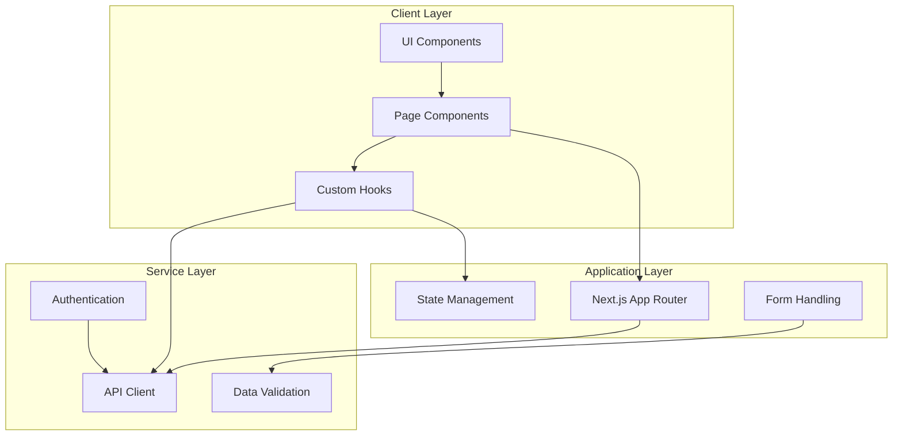
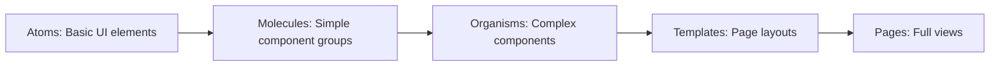
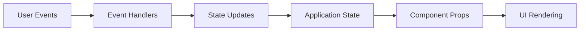
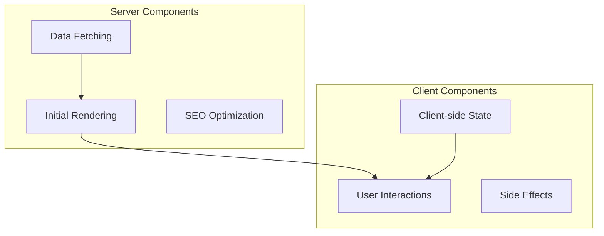
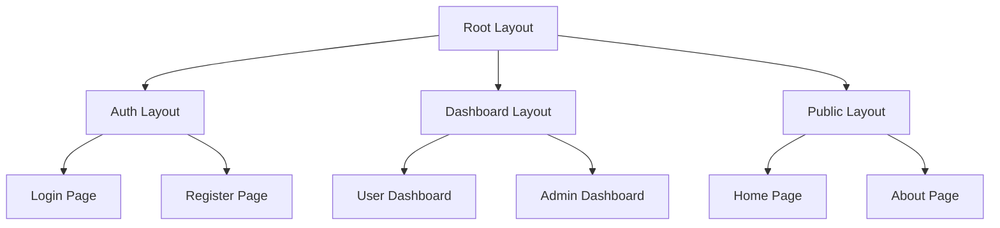
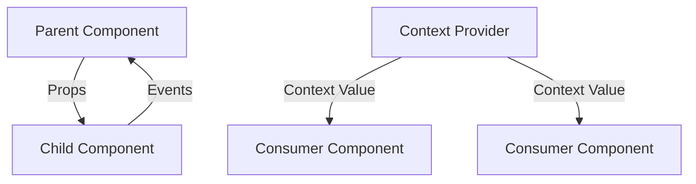

# System Patterns: Barangay Online Services

## Architecture Overview

The Barangay Online Services platform follows a modern frontend architecture using Next.js App Router, with a clear separation of concerns and component-based design.



## Key Design Patterns

### Component Architecture

#### Atomic Design Methodology

The UI is structured following atomic design principles:



- **Atoms**: Buttons, inputs, icons, typography
- **Molecules**: Form fields, search bars, notification items
- **Organisms**: Navigation bars, forms, document request cards
- **Templates**: Layout structures for different page types
- **Pages**: Complete views combining multiple organisms and templates

### Data Flow Patterns

#### Unidirectional Data Flow



- State is passed down through props
- Events trigger handlers that update state
- UI re-renders based on new state

#### Server and Client Components

Next.js App Router enables a hybrid approach:



- Server components handle data fetching and initial rendering
- Client components manage interactivity and client-side state
- "use client" directive marks client components

## Module Organization

### Feature-Based Structure

```
src/
├── app/                    # Next.js App Router pages
│   ├── (auth)/             # Authentication routes
│   ├── (dashboard)/        # Dashboard routes
│   ├── (public)/           # Public routes
│   ├── api/                # API routes (if needed for mocking)
│   └── layout.tsx          # Root layout
├── components/             # Shared components
│   ├── ui/                 # UI components (atoms/molecules)
│   ├── forms/              # Form-related components
│   ├── layout/             # Layout components
│   └── [feature]/          # Feature-specific components
├── lib/                    # Utility functions and shared logic
│   ├── utils.ts            # General utilities
│   ├── hooks/              # Custom React hooks
│   ├── validators/         # Form validation schemas
│   └── api/                # API client functions
└── styles/                 # Global styles and theme
```

## Key Technical Decisions

### Routing Strategy

- **App Router**: Using Next.js App Router for file-system based routing
- **Route Groups**: Organizing routes by feature using route groups (parentheses notation)
- **Layouts**: Shared layouts for consistent UI across related pages

### State Management

- **React Hooks**: Using React's built-in hooks for component state
- **Context API**: For sharing state across component trees when needed
- **Server Components**: Leveraging server components to reduce client-side state

### Form Handling

- **Controlled Components**: For form inputs with immediate validation
- **Form Libraries**: Consider React Hook Form for complex forms
- **Validation**: Client-side validation with potential for server validation

### Styling Approach

- **Utility-First**: Using Tailwind CSS for rapid UI development
- **Component Consistency**: Using ShadCN UI components for consistent design
- **Theme Variables**: CSS variables for theming and dark mode support

### Authentication Pattern

- **JWT Tokens**: Implemented with secure authentication flow
  ```mermaid
  flowchart TD
      Login[Login Form] --> Validate[Validate Credentials]
      Validate --> API[API Request]
      API --> JWT[Receive JWT]
      JWT --> Store[Store Token]
      
      Request[Protected Request] --> Check[Check Token]
      Check -->|Valid| Proceed[Make Request]
      Check -->|Invalid| Refresh[Refresh Token]
      Refresh -->|Success| NewJWT[New Token]
      Refresh -->|Failed| Redirect[Redirect to Login]
  ```
- **Form Validation**: Using Zod schema for login form validation
  ```typescript
  const loginSchema = z.object({
    login: z.string().min(1, 'Username or email is required'),
    password: z.string().min(1, 'Password is required'),
  })
  ```
- **API Integration**: Using custom useApiFetch hook for API requests
  ```typescript
  const { fetch } = useApiFetch('/api/v1/auth/login', {
    method: 'POST',
    body: loginData
  })
  ```
- **Protected Routes**: Middleware for route protection (in progress)
- **Role-Based Access**: Different interfaces for residents vs administrators (planned)

## Component Relationships

### User Interface Patterns

#### Layout Composition



#### Component Communication



## Error Handling Patterns

### Error Boundaries

- React error boundaries for catching and displaying errors
- Custom error pages for different error types

### Form Validation

- Inline validation with immediate feedback
- Form-level validation before submission
- Server validation response handling

## Performance Patterns

### Code Splitting

- Route-based code splitting with Next.js
- Dynamic imports for large components

### Image Optimization

- Next.js Image component for automatic optimization
- Responsive images with appropriate sizes

### Rendering Strategies

- Server components for data-heavy pages
- Client components for interactive elements
- Static generation for content that rarely changes

## Accessibility Patterns

### Semantic HTML

- Proper heading hierarchy
- ARIA attributes where needed
- Keyboard navigation support

### Focus Management

- Visible focus indicators
- Proper tab order
- Focus trapping for modals

## Responsive Design Patterns

### Mobile-First Approach

- Design for mobile screens first
- Progressive enhancement for larger screens

### Breakpoint System

- Consistent breakpoints using Tailwind's default system
- Component-specific responsive behavior

## Testing Patterns

### Component Testing

- Unit tests for utility functions
- Component tests for UI behavior
- Integration tests for feature flows

### Mocking Strategy

- Mock API responses for testing
- Mock authentication for protected routes
